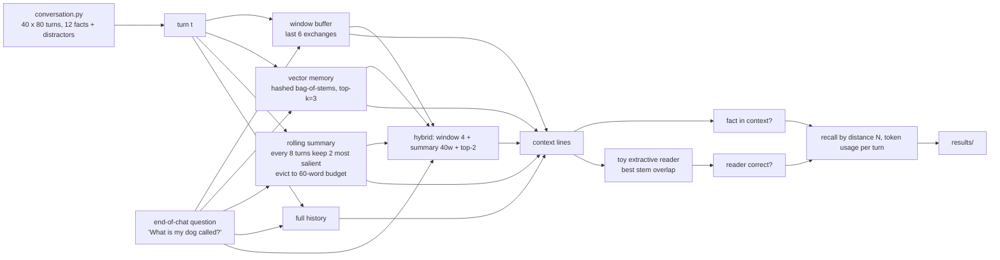

# ai-learn-19-agent-memory

**Phase D, day 19** of the AI learning track. A chat agent cannot keep the whole conversation in its prompt forever, so it needs a **memory policy**. This repo builds a toy conversational agent with five memory strategies from scratch:

- a **short-term window buffer**
- a **long-term vector memory**
- **rolling extractive summaries**
- a **hybrid** of all three
- a **full-history** upper bound

It replays 40 seeded 80-turn conversations in which a user drops 12 personal facts among small talk, including distractors like "my neighbour's dog barked all night". At the end it asks about every fact and measures **recall of facts stated N turns ago** and **token-budget usage**.

It follows chunking for document RAG (`ai-learn-18`) and turns the same retrieval ideas on the conversation itself. NumPy + matplotlib only, no LLM, no network, seed 42, under a second on CPU.

## What you'll learn

- How window, vector, summary and hybrid memories decide what the model gets to see, and what each one forgets.
- How to measure memory quality as recall vs distance N, separately from the reader. "The fact is in the context" and "the reader picked it" are different numbers.
- Why *more* context is not automatically better. Full history always contains the fact, but a naive reader is distracted by look-alike small talk.
- How to account for token budgets over time: linear growth, a flat window, and the sawtooth of summarise-every-k-turns.

## Architecture



## Layout

| path | purpose |
|---|---|
| `conversation.py` | seeded episode generator: 12 fact slots with statement/question templates, small-talk pool with keyword distractors |
| `memory.py` | `FullHistory`, `WindowBuffer`, `VectorMemory` (FNV-hashed embedder), `RollingSummary`, `HybridMemory`, `extractive_reader` |
| `evaluate.py` | replay episodes, whole-word answer matching, recall/reader accuracy per distance bin, context size per turn |
| `text.py` | tokenizer + stemmer (from `ai-learn-16`) |
| `run_smoke.py` / `smoke_plots.py` | smoke run, SVG plots, `RESULTS.md` |
| `notebooks/agent_memory_walkthrough.ipynb` | walkthrough: look inside each memory at the end of one conversation |
| `results/` | committed `RESULTS.md`, `metrics.json`, `JSON.shot`, `*.svg` |

## Run

```bash
python -m venv .venv && source .venv/bin/activate
pip install -r requirements.txt
python run_smoke.py
```

## Headline results (from `results/metrics.json`, 480 probes per strategy)

| strategy | fact in context | reader correct | N=1-5 | N=41-80 | words at probe | words/turn mean / peak |
|---|---:|---:|---:|---:|---:|---:|
| full_history | 1.000 | 0.590 | 1.000 | 1.000 | 964 | 489 / 964 |
| window (6) | 0.067 | 0.060 | 1.000 | 0.004 | 71 | 70 / 74 |
| vector (k=3) | 0.956 | 0.706 | 0.923 | 0.992 | **23** | 26 / 28 |
| summary | 0.485 | 0.473 | 0.654 | 0.361 | 56 | 86 / 141 |
| hybrid | **0.958** | **0.723** | **1.000** | 0.965 | 89 | 83 / 96 |

(The N columns are "fact in context" by distance.)

- **The window is perfect inside its horizon and useless beyond it.** It recalls 1.000 for N≤5, 0.147 at N=6–10, and 0.000 at N=11–40. The 0.004 at N=41–80 is a single false positive: the coffee answer "black" matched a recent "I drive a black Outback" line.
- **Vector memory is the best recall per token.** It gets 0.956 recall with about 23 words of context, 40x less than full history. Hybrid adds the window's perfect short-range recall and gets the best reader accuracy (0.723).
- **Rolling summaries forget gradually.** Recall drops from about 0.65 to 0.361 for the oldest facts, as re-compression evicts lines under the 60-word budget. The IDF salience heuristic cannot tell a rare fact from a rare piece of small talk.
- **Full history is not free and not best.** It always contains the fact, but the toy reader was right only 59% of the time because look-alike small talk distracted it ("Work was exhausting today" vs "What do I work as?"). It also costs about 964 words by turn 80 and grows linearly.

## Honest caveats

- Probes are asked at turn 80, which is exactly a summary boundary. The summary's probe-time context (56 words) is therefore its minimum; its per-turn peak is 141.
- The vector memory's *better* recall for older facts (0.992 at N=41–80 vs 0.923 at N=1–5) is an artefact of tie-breaking. When a fact and a distractor have equal cosine, the stable sort prefers the earlier turn. A recency tie-break or recency weighting would flip this.
- "Fact in context" is a whole-word string match, so values shared across slots (for example "black") can create rare false positives.
- The embedder is a hashed bag of stems, so paraphrased questions with no shared words would fail. The reader is a keyword heuristic, not an LLM.
- Distance bins are uneven (26 probes at N=1–5 vs 255 at N=41–80), because facts are placed uniformly over 80 turns.

## Next

This closes the retrieval-and-memory arc (days 15–19): KV cache, hybrid search, reranking, chunking and agent memory.
