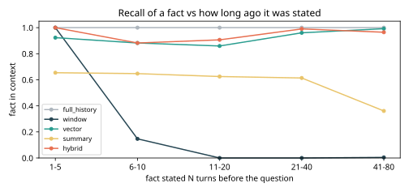
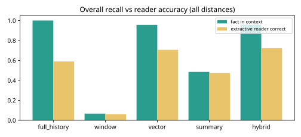
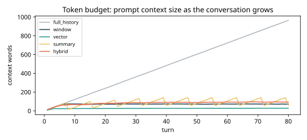

# Results -- ai-learn-19-agent-memory

**Seed:** `42` | 40 conversations x 80 turns | 12 facts per conversation, probed at the end (480 probes per strategy) | tokens = whitespace words

`contain`: the gold value appears somewhere in the context the memory returns. `reader`: a toy extractive reader (best stem overlap with the question) picks a line containing the value.

## Overall (real smoke run)

| strategy | contain | reader acc | ctx words at probe (mean) | ctx words at probe (max) | ctx words per turn (mean / peak) | reader acc / 100 words |
|---|---:|---:|---:|---:|---:|---:|
| `full_history` | 1.000 | 0.590 | 964.1 | 1000 | 488.5 / 964.1 | 0.06 |
| `window` | 0.067 | 0.060 | 71.2 | 86 | 70.1 / 73.6 | 0.08 |
| `vector` | 0.956 | 0.706 | 22.5 | 29 | 25.9 / 28.1 | 3.14 |
| `summary` | 0.485 | 0.473 | 56.4 | 60 | 86.2 / 141.4 | 0.84 |
| `hybrid` | 0.958 | 0.723 | 89.4 | 112 | 83.1 / 95.7 | 0.81 |

## Fact in context by distance N (turns between statement and question)

| strategy | N=1-5 | N=6-10 | N=11-20 | N=21-40 | N=41-80 |
|---|---:|---:|---:|---:|---:|
| `full_history` | 1.000 | 1.000 | 1.000 | 1.000 | 1.000 |
| `window` | 1.000 | 0.147 | 0.000 | 0.000 | 0.004 |
| `vector` | 0.923 | 0.882 | 0.859 | 0.960 | 0.992 |
| `summary` | 0.654 | 0.647 | 0.625 | 0.614 | 0.361 |
| `hybrid` | 1.000 | 0.882 | 0.906 | 0.990 | 0.965 |

## Reader accuracy by distance N (turns between statement and question)

| strategy | N=1-5 | N=6-10 | N=11-20 | N=21-40 | N=41-80 |
|---|---:|---:|---:|---:|---:|
| `full_history` | 1.000 | 0.735 | 0.609 | 0.653 | 0.498 |
| `window` | 1.000 | 0.088 | 0.000 | 0.000 | 0.000 |
| `vector` | 0.923 | 0.853 | 0.781 | 0.782 | 0.616 |
| `summary` | 0.654 | 0.647 | 0.625 | 0.604 | 0.341 |
| `hybrid` | 0.846 | 0.647 | 0.656 | 0.792 | 0.710 |

Probes per distance bin: N=1-5: 26, N=6-10: 34, N=11-20: 64, N=21-40: 101, N=41-80: 255

## Plots

Wall time: 0.80s on CPU.
